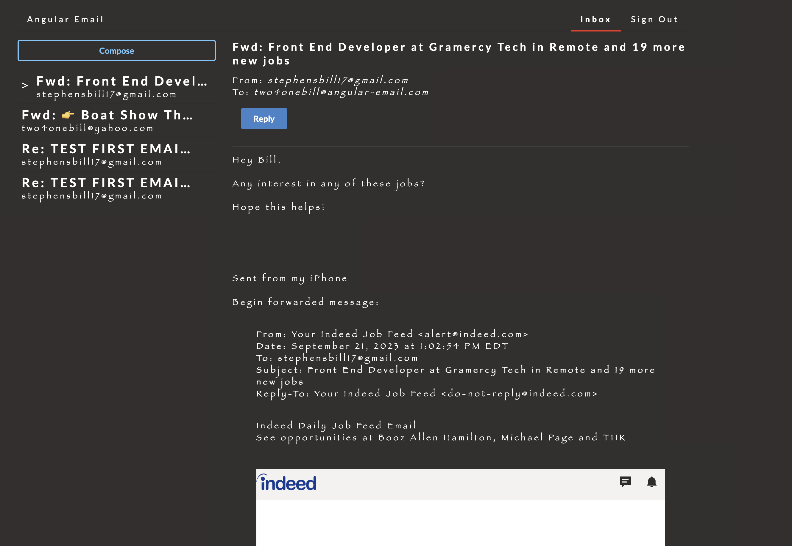

# EmailClient-Angular 

  ## Description

  This is an email client application built using Angular and a 3rd party API service on the back end.  Users can send and receive emails as well as reply to emails.

  Screenshot of app:

  
  
  ## Table of Contents
  
  - [Installation](#installation)
  - [Usage](#usage)
  - [License](#license)
  - [Contributing](#contributing)
  - [Tests](#tests)
  - [Questions](#questions)
  
  ## Installation
  
  Deployed URL: 
  
  ## Usage
  
  Click Compose to create a new email.  Click on emails to view content and reply.

  ## License
This application is covered under the MIT License.
 For more information: https://opensource.org/licenses/MIT
  
  ## Contributing
  N/A
  
  ## Tests
  N/A

  ## Questions
  Contact Info 
  GitHub user name: BillStephens2022 
  Link to GitHub profile: https://github.com/BillStephens2022 
  Email: stephensbill17@gmail.com
